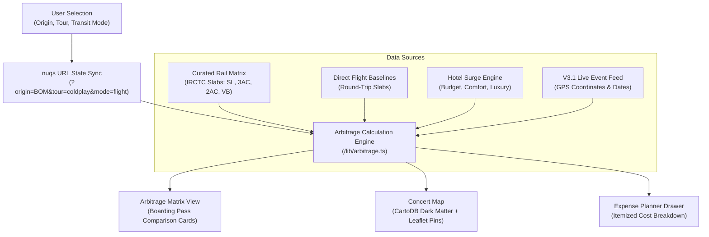

# BeatRoute 🎵✈️
### *The Concert Travel Arbitrage Engine*

[](https://opensource.org/licenses/MIT)
[](https://nextjs.org/)
[](https://turbo.build/)
[](https://react.dev/)
[](https://www.typescriptlang.org/)
[](https://tailwindcss.com/)
[](https://web.dev/cls/)

**BeatRoute** is a production-grade concert travel arbitrage engine designed for Indian music tours. When tickets sell out in tier-1 cities like Mumbai or Delhi—or surge to exorbitant scalper prices—BeatRoute calculates whether traveling to another tour stop (e.g. Ahmedabad, Indore, Chandigarh, Bengaluru, Pune) via flights or Indian Railways saves you net thousands of rupees, all-inclusive.

---

## 🎯 The Arbitrage Problem

When major stadium tours hit India, fans in metro cities face:
1. **Instant Sellouts**: Standing tickets sell out in seconds, forcing fans onto black-market reseller platforms at 3x–5x face value (₹25,000–₹40,000+).
2. **Ignored Alternative Stops**: The same artist often plays stadium or arena dates in secondary hubs (Ahmedabad, Indore, Chandigarh, Pune) where tickets remain accessible at standard face value (₹3,500–₹6,500).
3. **The Hidden Equation**: Traveling for a concert involves flight/train fares, hotel stays, and local transfers. BeatRoute automates this trade-off in real time to show you the **true net savings**.

$$\text{Net Arbitrage} = \text{Home Show Outlay} - \text{Away Trip Outlay}$$

$$\text{Total Trip Outlay} = \text{Ticket Tier} + \text{Round-Trip Transit} + \text{1-Night Hotel} + \text{Local Station/Airport Venue Cabs}$$

---

## 🏗️ System Architecture



---

## ✨ Core Features

- **Multi-Modal Travel Arbitrage**:
  - Compares round-trip direct flight baselines vs. Indian Railways telescopic distance slabs (`SL`, `3AC`, `2AC`, `Vande Bharat`).
  - Itemized trip budgets: `Concert Ticket + Transit + 1-Night Hotel + Local Venue Transfers`.
- **Interactive Dark Matter Concert Map**:
  - High-performance Leaflet map using **CartoDB Dark Matter** raster tiles ($0 zero-key footprint).
  - Custom SVG venue pin markers with city price previews, smooth pan/zoom (`flyTo`), and zero-memory-leak unmount cleanup.
- **Slide-Over Expense Planner Drawer**:
  - Live itemized breakdown modal allowing users to customize origin city, transit mode, rail seat class, and lodging tier (`budget`, `comfort`, `luxury`).
- **Live Event Discovery & Curated Tours**:
  - Integrated with the **V3.1 Live Event Engine** for real-time tour dates, GPS venue coordinates, and official ticket links without API key friction.
  - Curated showcases for major domestic tours: *Coldplay, Diljit Dosanjh, Karan Aujla, Ed Sheeran, Alan Walker, Bryan Adams*.
- **Zero Cumulative Layout Shift (CLS) & Sub-Second Latency**:
  - Next.js 16 App Router with React Suspense streaming boundaries and matching skeleton loaders.
  - Centralized design system driven by CSS custom variables in [`app/tokens.css`](file:///Users/sakshamvashishtha/Projects/beatroute/app/tokens.css).

---

## 🛠️ Tech Stack & Decisions

| Layer | Technology | Decision Rationale |
| :--- | :--- | :--- |
| **Framework** | Next.js 16 (Turbopack) | Sub-2s builds, React 19 compiler optimizations, 0 CLS streaming |
| **State Sync** | `nuqs` | URL search params as single source of truth; 100% shareable links |
| **Styling** | Tailwind CSS + `tokens.css` | Canonical CSS variables for neon concert glows, surfaces, and radii |
| **Mapping Engine** | Leaflet + CartoDB Dark Matter | Ultra-clean dark theme with 0 API keys and $0 infrastructure footprint |
| **UI Primitives** | Radix UI (`Dialog/Sheet`, `Slider`, `Tabs`), Framer Motion | Accessible primitives with layout-animated comparison cards |
| **Architecture Audit** | [`ARCH_LOG.md`](file:///Users/sakshamvashishtha/Projects/beatroute/ARCH_LOG.md) | ADR-001 through ADR-008 documenting all technical choices |

---

## 📂 Project Structure

```
beatroute/
├── app/
│   ├── api/concerts/route.ts     # Live concert discovery route handler
│   ├── error.tsx                 # Route-level error boundary
│   ├── global-error.tsx          # Root-level layout crash boundary
│   ├── globals.css               # Global Tailwind & Leaflet styles
│   ├── layout.tsx                # App root layout with font & providers
│   ├── not-found.tsx             # 404 Route Not Found page
│   ├── page.tsx                  # Main arbitrage dashboard (Suspense wrapped)
│   ├── providers.tsx             # NuqsAdapter wrapper
│   └── tokens.css                # Global design tokens (colors, glows, radii)
├── components/
│   ├── map/
│   │   ├── concert-map.tsx       # Leaflet map with CartoDB Dark Matter tiles
│   │   ├── concert-map-wrapper.tsx # Dynamic client loader with 0 CLS skeleton
│   │   └── concert-preview-sheet.tsx # Venue popover preview card
│   ├── matrix/
│   │   ├── arbitrage-matrix.tsx  # Comparison cards container
│   │   └── city-card.tsx         # Boarding-pass style comparison card
│   ├── navigation/
│   │   ├── header-nav.tsx        # Top navigation header with tour mode switch
│   │   └── view-toggle.tsx       # Accessible [List View | Concert Map] toggle
│   ├── planner/
│   │   └── expense-planner-drawer.tsx # Slide-over itemized expense calculator
│   ├── search/
│   │   ├── filter-bar.tsx        # Search, origin picker & trending artist pills
│   │   └── metrics-summary-strip.tsx # Highlights max savings & sweet-spot pick
│   └── ui/                       # Standardized reusable UI primitives
│       ├── badge.tsx
│       ├── button.tsx
│       ├── card.tsx
│       ├── empty-state.tsx
│       ├── error-state.tsx
│       ├── sheet.tsx
│       ├── skeleton.tsx
│       ├── slider.tsx
│       └── tabs.tsx
├── lib/
│   ├── api/concerts.ts           # V3.1 live event pipeline adapter
│   ├── arbitrage.ts              # Pure mathematical arbitrage calculation engine
│   ├── data/rail-fares.ts        # IRCTC telescopic distance & fare slabs
│   ├── mock-data.ts              # Curated tour catalog & baseline quotes
│   ├── types.ts                  # Domain models & TypeScript contracts
│   └── utils.ts                  # Tailwind class merge utility (cn)
├── ARCH_LOG.md                   # Architectural Audit Log (ADR-001 to ADR-008)
├── LICENSE                       # MIT License
└── README.md                     # Project documentation
```

---

## 🚀 Quickstart

### Prerequisites
- Node.js 18.17+ or 20+
- npm or pnpm

### Setup

```bash
# 1. Clone repository
git clone https://github.com/saksha-collab/beatRoute.git
cd beatroute

# 2. Install dependencies
npm install

# 3. Start development server
npm run dev
```

Open [http://localhost:3000](http://localhost:3000) (or the port specified in terminal) in your browser.

### Production Build

```bash
npm run build
npm run start
```

---

## 📄 License

This project is open-source and available under the [MIT License](LICENSE) — see the [LICENSE](LICENSE) file for details.
